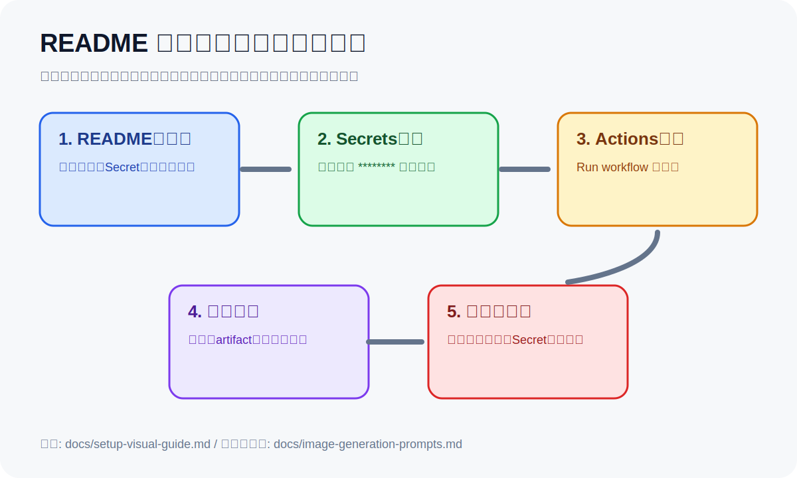

<!-- AI_README_SETUP_GUIDE_START -->
## 🧭 画像付き初期設定ガイド



このリポジトリ **enoking-monitor-starter** を初めて開いた人は、まずここだけ見れば初期設定から実行、成果物確認まで進められます。

### 最初にやること

1. 必要なSecretや外部サービス設定を確認します。
2. GitHub Actions または README の実行手順に沿って動かします。
3. 実行ログと成果物を確認します。
4. エラー時は Actions の失敗ステップと Secret名を確認します。

### 詳しい画像付きガイド

- [docs/setup-visual-guide.md](docs/setup-visual-guide.md)
- [docs/image-generation-prompts.md](docs/image-generation-prompts.md)

> SecretやAPIキーの実値は、README、Issue、ログ、画像に絶対に貼らないでください。例では `********` または `YOUR_SECRET_HERE` を使います。

<!-- AI_README_SETUP_GUIDE_END -->


# Enoking 仕入れ監視スターター

エノキング買取価格と仕入れ先URLの価格・在庫シグナルを突合し、粗利が一定以上ある候補をCSV出力するスターターです。

---

## 🆕 アービトラージ・デイリーダイジェスト（拡張版エンジン）

エノキング1社に限定せず、**複数の買取店・フリマ実勢を横断**して最も高く売れる出口を自動選定し、**毎日必ずTelegram配信**する拡張エンジンです。`src/daily_digest.py` がエントリポイント。

### できること

- **1商品＝複数売り先**を持ち、`買取(持込)`／`フリマ(メルカリ等)`を横断して**実質手取りが最大の売り先を自動採用**（`config/sell_destinations.csv`）。
- **ポイント還元・フリマ手数料・送料を加味した「実質」損益**で判定。
  - 実質仕入れ ＝ 表示価格 − ポイント分 ＋ 受取送料
  - フリマ純益 ＝ 表示価格 ×(1 − 手数料率) − 発送料
  - 価格差 ＝ 最高手取り − 実質仕入れ
- **JANダブルチェック**（`src/jan_verify.py`）：仕入れページにJAN／型番／名称が一致するか検証し、**照合できたものだけ買い候補**に昇格（誤マッチ防止）。✅JAN一致／🟡型番・名称一致／⚠️未照合 をバッジ表示。
- **買い候補の条件**：`実質差額 > 0`（ポイント込みで少しでもプラス）かつ `在庫あり` かつ `新品` かつ `照合済`。
- Telegramは**仕入れ先・売り先の両方を直URLハイパーリンク**で表示し、価格差がひと目で分かる。買い候補ゼロの日も価格差ランキングを必ず送る。

### 設定ファイル（拡張エンジン用）

```text
config/
  products.csv            # JAN・商品名・カテゴリ・型番（識別の核）
  buy_sources.csv         # 仕入れ先URL・想定価格・ポイント還元率・送料・パーサー
  sell_destinations.csv   # 売り先（買取/フリマ）・価格・URL・手数料率・送料（1商品に複数可）
```

> 既存の `products_sample.csv` / `supplier_urls.csv`（`monitor.py` 用）はそのまま残し、daily-monitor / restock-watch は従来通り動作します。

### 実行

```bash
python src/daily_digest.py            # Telegram配信
python src/daily_digest.py --dry-run  # 送信せず内容を標準出力で確認
```

### 自動実行（CLI不要・PC非依存）

`.github/workflows/daily-digest.yml` が**毎日 09:00 JST にクラウドで自動実行**します。PCの電源やCLI起動に一切依存しません。Repository Secrets の `TELEGRAM_BOT_TOKEN` / `TELEGRAM_CHAT_ID` を使用。手動実行は `gh workflow run daily-digest.yml`。

---

## 対象商品

| JAN | 商品 | 最高買取(売り先) | 主な仕入れ先 |
|---:|---|---:|---|
| 4902370552683 | Nintendo Switch 2 多言語版 BEE-S-KB6AA | 76,500円(エノキング) | My Nintendo Store / Yahoo! / 楽天 |
| 4902370548501 | Nintendo Switch 有機ELモデル ネオン | 45,300円(エノキング) | ヨドバシ / ノジマ / TSUTAYA / イオン |
| 4902370553031 | Switch 2 マリオカートワールドセット BEE-S-KB6PA | 57,500円(エノキング)/57,100円(ルデヤ) | **コストコ 52,780円** / マイニンテンドー |
| 4948872016940 | PlayStation5 Slim ダブルパック CFIJ-10018 | 99,500円(ルデヤ)/97,000円(カウモバイル) | **ソニーストア 89,980円**(粗利+9,520円) / 価格.com |
| 4902370553505 | Switch 2 ポケモン LEGENDS Z-Aセット | 55,500円(エノキング)/55,100円(ルデヤ) | マイニンテンドー / 楽天 / Yahoo! |

> 買取価格は売り先を横断した最高値。商品ごとの内訳は `config/products_sample.csv` の `buyback_source` 列を参照。

## 入荷監視（在庫切れ→在庫ありの検知）

利益の出る本命商品（コストコのマリカセット、ソニーストアのPS5ダブルパック）は**在庫切れ/入荷待ちが常態**で、ボトルネックは「割安な仕入れ先の再入荷を取れるか」です。そこで在庫の遷移を検知して通知します。

- `config/supplier_urls.csv` の `restock_watch` を `true` にした仕入れ先が監視対象。
- ある仕入れ先が「在庫切れ(0)」から「在庫あり」に変わった瞬間にだけ `🔔 入荷検知` を通知（初回観測では鳴らさない＝launchノイズ防止）。
- 前回在庫状態は SQLite (`output/resale_db.sqlite`) に保存。ローカルのループ実行ではそのまま永続化され、GitHub Actions では `actions/cache` で実行間に引き継ぎます。
- `RESTOCK_WATCH_ONLY=1` を設定すると `restock_watch=true` の仕入れ先だけを高頻度チェック（軽量）。

```bash
# 入荷監視のみを回す（軽量・高頻度向け）
RESTOCK_WATCH_ONLY=1 python src/monitor.py
```

GitHub Actions では `.github/workflows/restock-watch.yml` が30分ごとに入荷監視を実行します。

## 買い候補条件

```text
エノキング買取価格 - 仕入れ価格 >= 2,000円
かつ新品
かつ在庫あり
かつ送料込み
かつ注文キャンセルリスクが低い店舗
```

このリポジトリの初期実装では、価格と在庫文言から一次判定します。数量制限、会員ランク、キャンセルリスクは `notes` と手動確認で補完する想定です。

## ローカル実行

```bash
python -m venv .venv
. .venv/bin/activate  # Windows: .venv\Scripts\activate
pip install -r requirements.txt
python src/monitor.py
```

結果は `output/monitor_result_YYYYMMDD_HHMMSS.csv` に出力されます。

## GitHub Actionsで毎日監視

`.github/workflows/daily-monitor.yml` により、毎日 09:30 JST に監視を実行します。

- 実行結果CSVはGitHub ActionsのArtifactsに保存されます。
- `SLACK_WEBHOOK_URL` または `DISCORD_WEBHOOK_URL` をRepository Secretsに設定すると、買い候補が出た時だけ通知します。
- 手動実行は GitHub Actions の `Daily supplier monitor` から `Run workflow` を押します。

## 注意

- 自動購入はしません。価格・在庫候補の検知までです。
- My Nintendo StoreやTSUTAYAなどJavaScript必須ページは、`requests` だけでは取得できない場合があります。その場合は `NEEDS_BROWSER` として記録します。
- 利用規約、アクセス頻度、robots.txt、会員条件、購入制限を守ってください。
- 価格・在庫は変動するため、購入前に必ず公式ページで確認してください。

## ディレクトリ

```text
config/
  products_sample.csv      # JAN・商品名・エノキング買取価格
  supplier_urls.csv        # 監視URL・想定価格・パーサーヒント
src/
  monitor.py               # 監視本体
output/                    # 実行結果CSV出力先
.github/workflows/
  daily-monitor.yml        # 毎日実行
```
