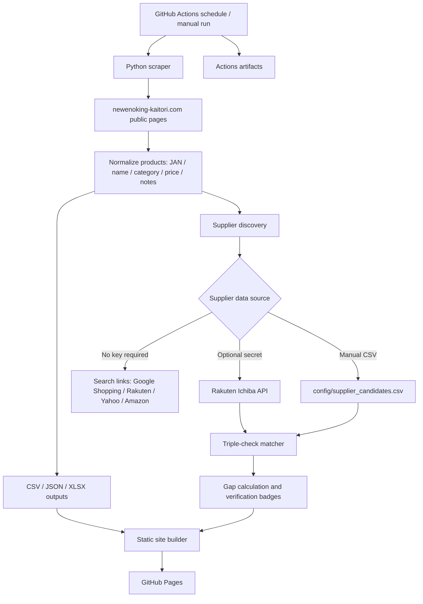
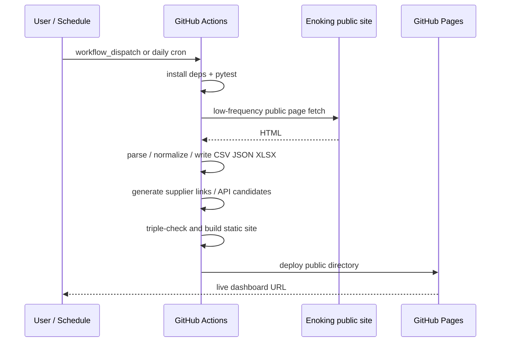

# Enoking Cloud Monitor アーキテクチャ

## 目的

`https://newenoking-kaitori.com/` の公開商品情報を、PCに依存せず毎日クラウドで取得し、JANコード・商品名・カテゴリ・参考買取金額・備考・取得元を保存します。さらに仕入れ先候補のURL、仕入れ値、価格差、商品一致確認のトリプルチェック状態を静的Webサイトで確認できるようにします。

## 全体像

## コンポーネント

### `src/enoking_scraper.py`

- `/products`、`/featured`、カテゴリページ、ページ送りを低頻度で巡回します。
- 商品カードから JAN、商品名、カテゴリ、参考買取金額、備考、現金買取可否、画像URL、取得元URLを抽出します。
- 同一JANは重複排除し、価格が複数ページで見えた場合は高い買取価格を採用します。
- ログイン、カート操作、購入、自動申請、アクセス制御回避は行いません。

### `src/supplier_discovery.py`

- APIキーなしでは、JANベースの検索リンクを生成します。
- `config/supplier_candidates.csv` に仕入れ候補URLと価格を入れると、自動で価格差と一致確認を行います。
- `RAKUTEN_APPLICATION_ID` をRepository Secretに入れると、楽天市場APIから候補を取得できます。

### `src/product_matcher.py`

仕入れ先の誤マッチを防ぐため、次の3段階で判定します。

1. JAN完全一致
2. 商品名・型番・モデルコード一致
3. 色・容量・バリエーション矛盾なし

結果は `VERIFIED_EXACT_TRIPLE_CHECKED`、`LIKELY_MATCH_NEEDS_MANUAL_JAN_CONFIRM`、`REJECT_OR_MANUAL_REVIEW` としてWeb画面に表示されます。

### `src/site_builder.py`

- `output/latest_enoking_products.json` と `output/latest_opportunities.json` から `public/` を生成します。
- GitHub Pagesにそのままデプロイできる静的HTMLです。
- バックエンドサーバー、DB、常時稼働インスタンスは不要です。

## CI/CD

## 本番運用に必要なもの

必須のSecretはありません。最低コスト構成ではGitHub ActionsとGitHub Pagesだけで動きます。

任意Secret:

- `RAKUTEN_APPLICATION_ID`: 楽天市場APIで仕入れ候補を自動取得する場合のみ必要。

## GPT Image 最新モデル向けアーキテクチャ説明プロンプト

READMEや運用資料に図解を追加したい場合は、GPT Imageの最新モデルに次のプロンプトを入力してください。

> GitHub Actionsが毎日newenoking-kaitori.comの公開商品ページを低頻度でスクレイピングし、JAN・商品名・カテゴリ・買取価格をCSV/JSON/XLSXに保存し、仕入れ候補検索リンクと任意API結果をトリプルチェックしてGitHub Pagesの静的ダッシュボードに公開するアーキテクチャ図を、日本語ラベル、初心者向け、青系のクラウド構成図として作成してください。
